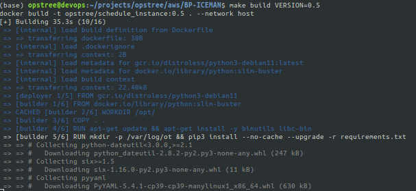
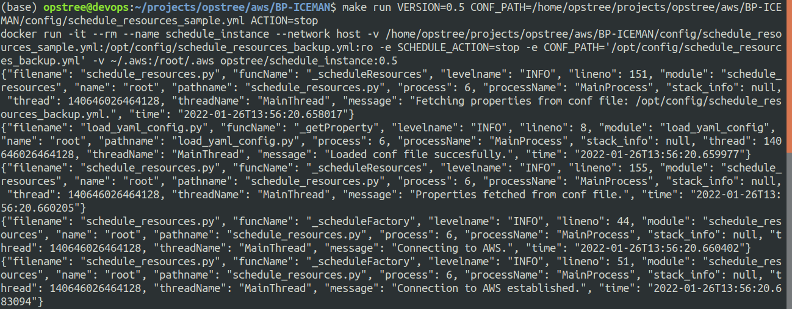

# BP-ANTMAN 

As **ANTMAN** has capability to resize, similarly I'll help to resize the AWS resources based on user-defined tags and user-defined actions.

## SERVICES SUPPORTED
- REDIS
- RDS

## CONFIGURATIONS 
Configuration for this utility will be managed in YAML format. Below are the configurations details :

- ***aws_profile (Optional) :*** It is a aws profile that you can use to a perform resize resources actions in AWS. If not specified, then utility will use default credentials.

- ***region (Optional) :*** The AWS Region where this utility is executed.

- ***services:redis:tags (Optional) :*** Tags given to ec2 instances.This utility will start/stop all the ec2 instances matches to this given tags.

- ***services:rds:tags (Optional) :*** Tags given to rds .It will resize all the rds matches to this given tags.

## SAMPLE CONF FILE

```
aws_profile: default
region:
      - us-east-1
      
services:
  rds:
    resize_params:
        allocatedStorage: 70
        dbInstanceClass: "db.t2.micro"
    tags:
       "Key": "owner"
       "Value": "opstree"

  redis:
    resize_params:
        cacheNodeType: "cache.t2.medium"
    tags:
       "Key": "owner"
       "Value": "opstree"

tags:
   "Key": "owner"
   "Value": "opstree"
```

## USAGE

===============================================================

### LOCALLY
To run this utility locally from your system.Follow below steps.
- Clone this repo.
- Create your configuration file. Can take reference from ```config/arg.yml```.
- Export two environment variables .
   - ```CONF_PATH:``` Path of the configuration file.
   
   - ```SCHEDULE_ACTION:``` Action which is  going to perform i.e resize.

   ```
   export CONF_PATH="/home/opstree/BP-ICEMAN/config/arg.yml"
   ```
   ```
   export SCHEDULE_ACTION="resize"
   ```

- Run the python script.

   ```
   python3 scripts/script.py 
   ```

### USING DOCKER
To run this utility using docker.Follow below steps.
- Clone this repo.
- Make changes to configuration files as required i.e config/arg.yml.
- Build the docker image using Makefile
  ```
   make build VERSION=<Provide image tag here>
  ```
  

- Run the application
  ```
  make run VERSION=<Provide build image tag> CONF_PATH=<Conf-Path> ACTION=<resize>
  ```
   
